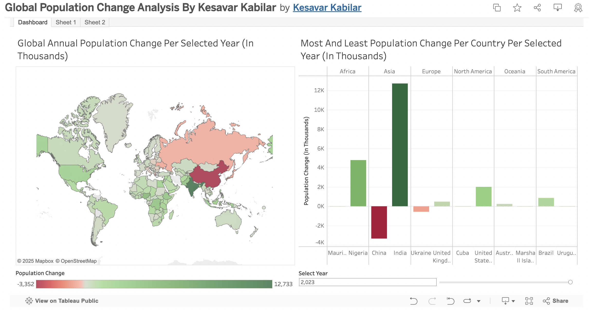
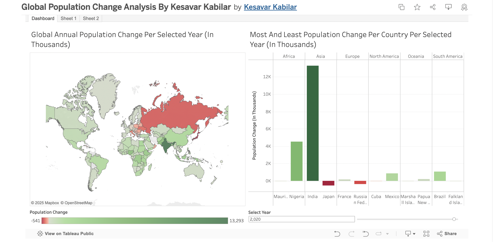
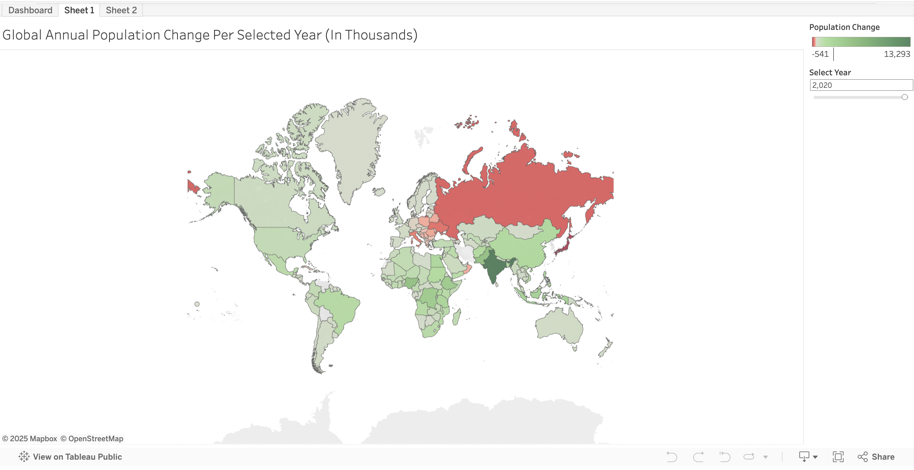
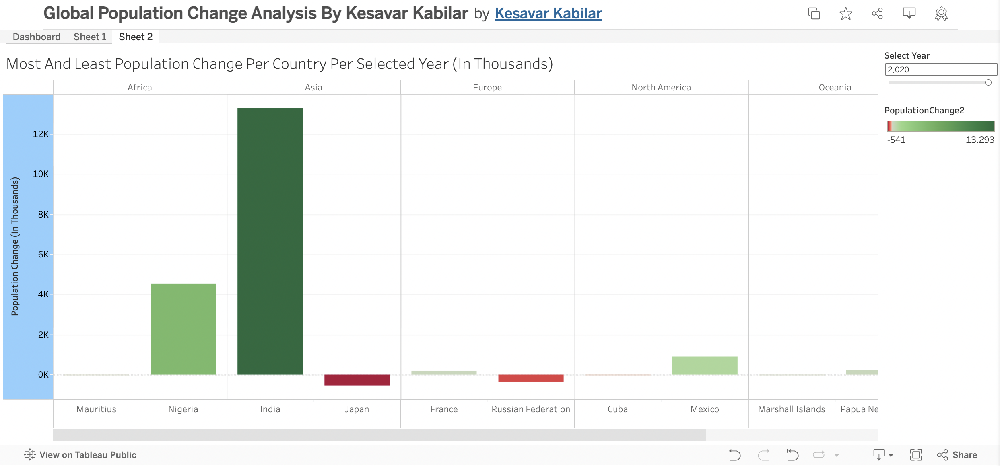
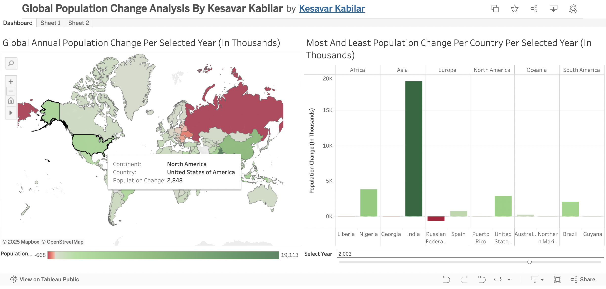
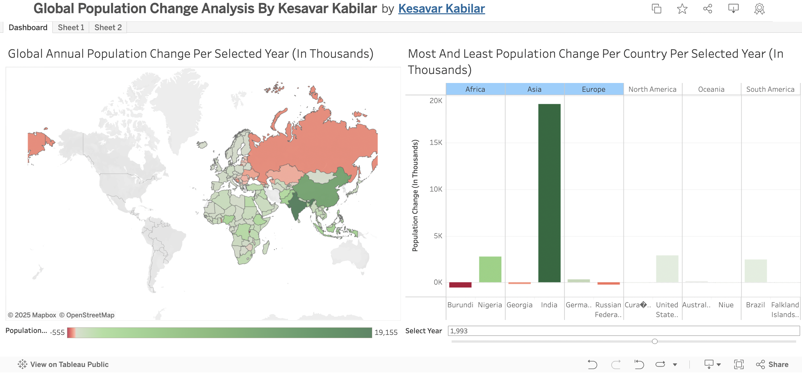

# Global Population Change Analysis (Tableau Dashboard)

I utilized C++ for data cleaning and transformation to generate the `modified_data_one.csv` and `modified_data_two.csv` files, which were subsequently integrated into the Tableau dashboard to visualize the Global Population Change Analysis.

Dashboard: https://public.tableau.com/views/GlobalPopulationChangeAnalysisByKesavarKabilar/Dashboard1?:language=en-US&:sid=&:redirect=auth&:display_count=n&:origin=viz_share_link

Original Data: https://population.un.org/wpp/downloads?folder=Standard%20Projections&group=Most%20used

Cleaned Data For Choropleth Graph: ./modified_data_one.csv

Cleaned Data For Grouped Bar Chart: ./modified_data_two.csv

## Question We Want To Analyze With This Dasboard: 

Which major global regions experienced major population increase and major population decrease in a selected year and which specific countries contributed to that major population increase and population decrease in that selected year?

## Answer (As seen in the image for the selected year 2020): 

In 2020, Asia experienced the most significant overall population increase, with countries like India and China showing very large positive changes. Conversely, Europe faced a severe population decrease across several of its countries, with the Russian Federation, Ukraine, and Italy being prominent examples of those contributing to the decline.

World Map (Left Chart): This chart provides the essential geographic overview and the initial identification of trends. By observing the map for the year 2020, we can quickly see broad areas coloured in dark green, indicating a significant population increase (e.g., across much of Asia, particularly India and China). Simultaneously, large areas in red, primarily across Europe (including Russia and Ukraine), visually confirm regions of significant population decrease. 

Grouped Bar Chart (Right Chart): This chart provides the country-specific details that quantify the regional trends observed on the map. Once a region of interest is identified on the map (Asia for the most population increase, or Europe for the most population decrease), the bar chart indicates individual countries that are causing the most impact. For example in Asia, the tall green bars for India show their substantial positive population change. On the other hand, for Europe, the prominent red bar for Russia distinctly indicates their significant population decreases.

The combination of these two charts allows us to depict and understand overall regional trends and explanations for certain strange population changes. As an example in the year 2020, a major event took place. The Covid-19 first began with a severe impact in Europe. My chart is easily able to depict the region (Europe from the graph on the left) where Covid-19 severely affected those countries. With the most affected country being Russia (From the graph on the right). Along with Russia, you can also tell that Japan has also had a severe impact from COVID-19 and its already declining birth rate. From the graph on the right, we can tell that Japan had the lowest population decrease of all countries in 2020.

## How does the layout of these charts promote visual understanding of the data across multiple charts? Make sure your explanation describes color consistentcy, alignment and any other ways the layout improves visual understanding.

This dashboard's layout of the World Map and the Grouped Bar Chart on the right is designed to give a good understanding of the extreme countries that most significantly impact the population change as well as a regional understanding allowing viewers to understand specific regions of countries impacted by population change.

The World Map on the left provides a geographical overview of population changes. Users can quickly identify broad regions experiencing significant growth (darker green) or decline (darker red) at a glance. 

On the other hand, the Grouped Bar Chart on the right offers specific, and extreme details on the country with the most impact. Once a trend is spotted on the map, the viewer can immediately refer to the adjacent bar chart to pinpoint the specific countries driving the most extreme population changes within those continents, seeing their exact magnitudes. 

For optimal understanding, colour consistency is used in the diverging green-to-red scheme, ensuring the world map and the bar chart adopt the same colour scheme to create a unified visual language, instantly conveying positive and negative changes across both charts. Along with the alignment of the World Map on the left and the grouped bar chart on the right. This allows easy comprehension when comparing both charts. In addition, the bar at the bottom left sets a numerical value for the specificied colors. Also, the user can select the year with the bar in the bottom right which automatically changes the data for the graph after the year is selected. This allows viewers to easily compare different eras from 1950 to 2023. 

In addition, the interactive cross-filtering significantly enhances comprehension. Clicking a country on the map filters the bar chart to its continent's extremes. Clicking a bar highlights the continent on the map. This dynamic linking allows users to actively explore relationships between geographical patterns and detailed country-level data.

## Indicate which chart is the "first" chart. Then justify the choice of this chart type, its axes and marks based on the data variables it shows.

The world map on the left is the first chart. This graph is a choropleth map and it is used for its ability to visualize the geographic distribution of population change. Allowing viewers to quickly identify global patterns of growth or decline. Its purpose is to provide immediate spatial context to understand if the population increases or decreases in a specific region for a specific year.

For the axes, the map utilizes Latitude and Longitude to define the geographical coordinates for each country. The marks for each country are based on the population change for that country. Depending on the value, a continuous diverging green-to-red colour scheme is used to effectively communicate the magnitude of population change across various countries. 

## Indicate which chart is the "second" chart. Then justify the choice of this chart type, its axes and marks based on the data variables it shows.

The Grouped Bar Chart on the right is the second chart. This graph is a grouped bar chart and it is used for its ability to visualize the extreme ends of the population growth and decline for each continent in a selected year. Its purpose is to provide details on the extreme ends and to precisely compare population change among the extreme ends for each country in its continent. 

For the axes, Continent and Country are placed on the rows shelf to create a hierarchical grouping and individual bars for each country. Population Change is on the columns shelf, defining the length and direction of the bars (positive to the top, negative to the bottom). The Population Change (In Thousands) axis provides a clear scale for quantitative comparisons for extreme ends. The marks are based on the population change for each country, intentionally configured to show only the highest and lowest values per continent. Depending on the value, a continuous diverging green-to-red colour scheme is used to effectively communicate the magnitude of population change across various countries. 

## How does your dashboard provide details on demand?

The "Select Year" parameter allows the viewers to select a year on which the two charts' data will be based upon. Upon selection, the information presented on both the World Map and the Grouped Bar Chart automatically updates to reflect the population changes for that chosen year. This provides users with the ability to explore annual trends and see how population dynamics shift over time, on demand.

Additionally, when a user hovers their mouse over any country on the World Map (left graph), a detailed information table appears. This information table specifies the exact name of the country, its corresponding continent, and the precise amount of population change for that country (in thousands) during the selected year.

Similarly, when a user hovers their mouse over any bar in the Grouped Bar Chart (right graph), another detailed information table is displayed. This information table also provides the specific country name, the continent it belongs to, and the exact population change amount (in thousands) for that country in the selected year. 

This information table's functionality allows users to retrieve data for individual data points without cluttering the main visualizations.

## How does your dashboard support cross-filtering between these two charts? The cross filtering must be bi-directional, such that a selection made in the first chart is reflected in the second chart, and a selection made in the second chart is reflected in the first chart.

My dashboard allows bi-directional cross-filtering through dashboard filter actions, allowing users to highlight only the necessary continents that the viewers want to analyze.

When a viewer clicks on a country (or multiple countries) on the World Map (first chart), a filter action transmits the corresponding Continent to the Grouped Bar Chart (second chart). This updates the bar chart to display the most and least extreme population changes within that selected continent (or multiple continents).

Conversely, when a viewer clicks on a bar (representing a specific country) on the Grouped Bar Chart, a filter action highlights that particular country's continent on the World Map. If, instead, the user clicks on a continent header on the Grouped Bar Chart, the entire corresponding continent is highlighted on the World Map. 

Viewers can select multiple continents on either graph, allowing them to filter the display and focus exclusively on population changes within their chosen regions. This feature offers greater control over the analysis, highlighting specific areas on demand.  

